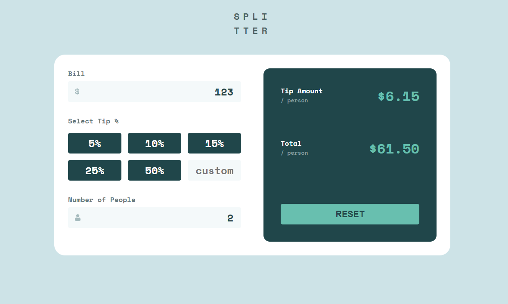
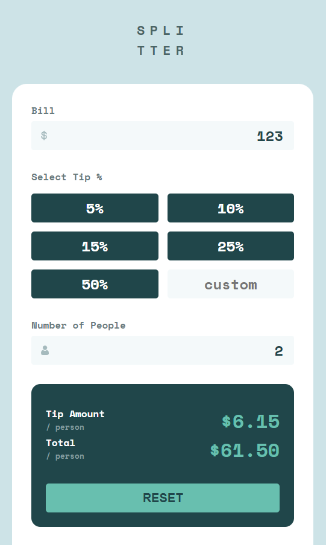

# Frontend Mentor - Tip calculator app solution

This is a solution to the [Tip calculator app challenge on Frontend Mentor](https://www.frontendmentor.io/challenges/tip-calculator-app-ugJNGbJUX). Frontend Mentor challenges help you improve your coding skills by building realistic projects.

## Table of contents

- [Overview](#overview)
  - [The challenge](#the-challenge)
  - [Screenshot](#screenshot)
  - [Links](#links)
- [My process](#my-process)
  - [Built with](#built-with)
  - [What I learned](#what-i-learned)
  - [Continued development](#continued-development)
- [Author](#author)

## Overview

### The challenge

Users should be able to:

- View the optimal layout for the app depending on their device's screen size
- See hover states for all interactive elements on the page
- Calculate the correct tip and total cost of the bill per person

### Screenshot

### Links

- Solution URL: [Add solution URL here](https://github.com/Naetharu/Front-End-Mentor-Tip-Calculator)
- Live Site URL: [Add live site URL here](https://naetharu.github.io/Front-End-Mentor-Tip-Calculator)

## My process

- This was just a basic HTML/CSS/JS build. I created the app mobile first. I was working with the FIGMA files. I started creating the HTML structure. Then built out the CSS. And then added in the JS functionality last. Once I had the mobile version fully working I then added the addtional CSS media queries to make a desktop version too. The design is a fixed size for desktop users and swaps to that version at ~1000px wide screens. Below that it uses the mobile version, which has a fixed max width of 500px and centres in the screen.

### Built with

- HTML
- CSS
- JavaScript
- Flexbox
- CSS Grid
- Mobile-first workflow

### What I learned

This was quite a simple piece. However, there were some interesting parts in the build. Getting everything perfeclty aligned was fun, and working with the FIGMA designs was really enjoyable. The biggest challenge was keeping my CSS tidy. I actually re-did the CSS as the first version, while functional, was a bit of a mess. I removed it and started again, but in a more methodical process and this really helped. I'll continue to use this method going forward, as it made it much easier to understand what was happening with the design.

### Continued development

Going forward my next project will be in React. I'm considering re-doing this design in React as a fun exercise to do a side by side comparison.

## Author

- Frontend Mentor - [@naetharu](https://www.frontendmentor.io/profile/naetharu)
